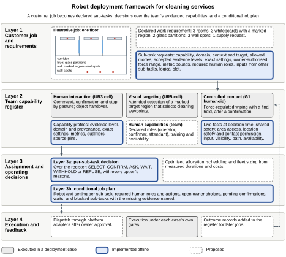
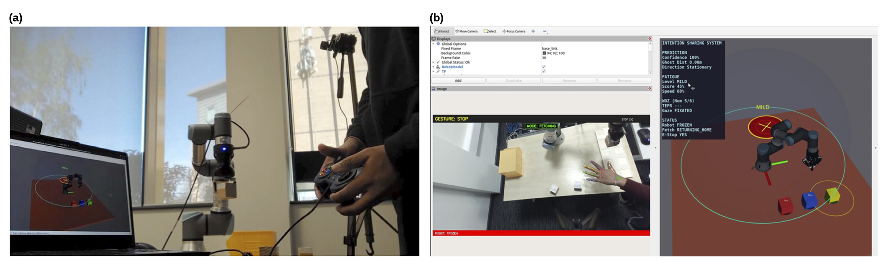
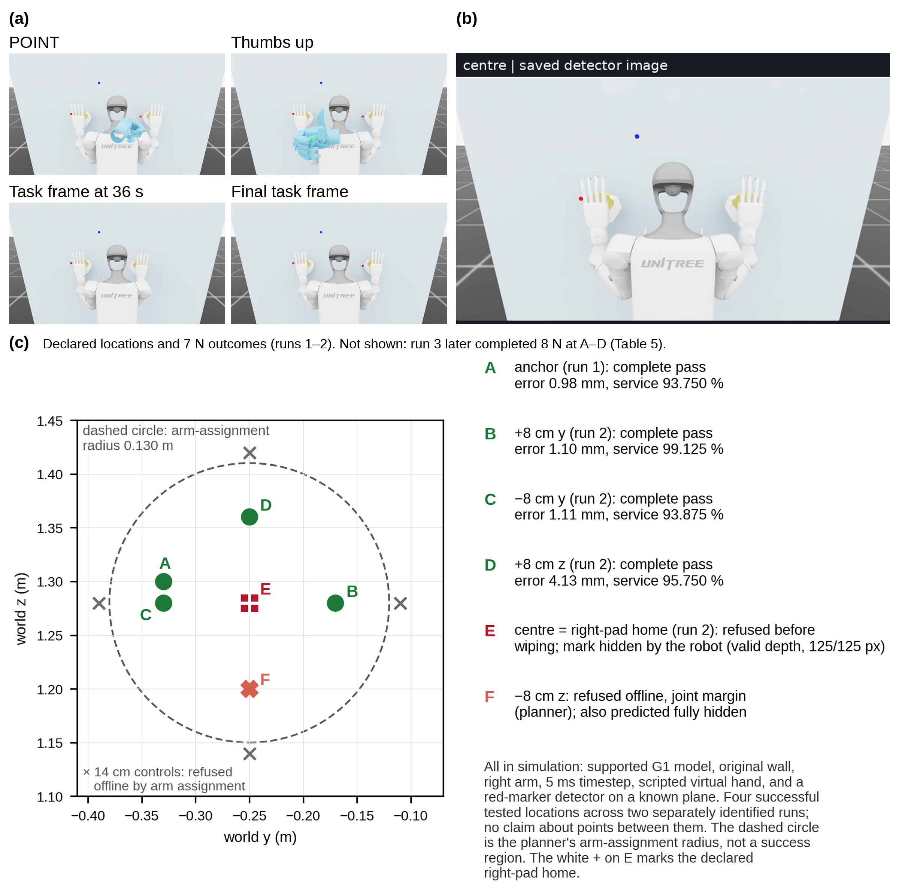

# Industry 5.0 robot deployment framework

This framework plans cleaning work around robot capabilities and human roles.
A cleaning job is split into tasks. For each task, the framework checks the
available evidence, operating conditions and human roles, then returns supported
options or explains what is missing. This repository contains the offline
decision code, worked plans and reduced G1 measurements accompanying
*Industry 5.0-Based Framework for Robot Deployment in the Cleaning Service Industry*.

[Watch the video](https://www.youtube.com/watch?v=7y4VK848laA) · [Quick start](#quick-start) · [Framework](#framework) · [Robot cases](#robot-cases) · [File guide](#files-a-reviewer-will-use) · [Data definitions](#measurement-definitions)

## Quick start

Use a Python 3.12 environment. Install NumPy for the measured-data calculations,
then run the checks from this folder:

```bash
python3 -m pip install numpy==2.3.5
python3 -B reproduce_all.py
```

The launcher runs 12 commands and stops if one fails. It recreates the job plans,
checks their recorded outputs, runs the tests and recalculates the force summaries.
Logs and measurement summaries go in `verification/`; plans and their table go in
`job_example/results/`. File checks are automatic. Running the analyses uses no
AI tool, internet connection, robot or simulator. Installing NumPy may require
an internet connection.

## Framework

<p align="center">
  <a href="figures/figure1_deployment_framework.svg">
    
  </a>
</p>

A job plan shows supported robot settings, required human roles, choices waiting
for an owner and tasks held back by missing evidence or failed checks. The diagram
distinguishes the planning components implemented offline from the proposed
connections to execution. All three robot systems were studied separately.

[Open the diagram](figures/figure1_deployment_framework.svg) · [Editable PowerPoint](figures/figure1_deployment_framework.pptx)

## Robot cases

| Robot | Capability illustrated | Evidence |
| --- | --- | --- |
| **UR3** | Human commands, confirmation, stopping and object handover | Physical robot cell; published study |
| **UR5** | Visual targeting within an automatic wiping loop | Physical robot prototype; documented demonstration |
| **G1** | Wiping and final hold at tested force settings after virtual-hand confirmation | Simulation with the robot held at the pelvis |

### UR3: human interaction

<p align="center">
  <a href="figures/figure2_ur3_case.png">
    
  </a>
</p>

The physical cell and the STOP-gesture display illustrate the human-interaction
case. Reproduced from [Goonetilleke and Khalid (2026)](https://doi.org/10.3389/frobt.2026.1897261),
*Frontiers in Robotics and AI* 13:1897261, under CC BY.

### UR5: visual targeting

The prototype detects the framed region, follows a predefined wiping pattern and
returns home to check for remaining red marks. An attendant starts the program
and observes. To decide when to stop, the prototype uses HSV colour detection, and active
contact-force regulation was not implemented. The repository includes the capability records
and a [summary of the developer's answers](records/UR5_OPERATION_CONFIRMATION_R37.json).

### G1: point, confirm, wipe and hold

[Watch the G1 simulation video on YouTube](https://www.youtube.com/watch?v=7y4VK848laA) (4 min 54 s).
The video compares 7 N and 8 N runs side by side and explains the outcomes at A–F.

<p align="center">
  <a href="https://www.youtube.com/watch?v=7y4VK848laA">
    
  </a>
</p>

Four locations, A–D, completed the wipe and final hold at both 7 N and 8 N.
The location map above shows the earlier 7 N outcomes, while the 8 N results are in the
[force-setting results table](catalogue_r3/source/RESULTS_TABLE.md).
At E, the robot's own body hid the target, and wiping was refused before it started.
F failed the offline joint-margin screen and was never run. These discrete settings were tested in a
pelvis-supported simulation, and maximum force and physical G1 performance remain unestablished.

The images above are the existing manuscript figures. Their sources are recorded
in [FIGURE_SOURCES.json](figures/FIGURE_SOURCES.json).

## Files a reviewer will use

| Files | Purpose |
| --- | --- |
| `selector/*.py`, `analysis/*.json` | Decision rule, its tests and saved examples |
| `catalogue_r3/` | Before/after evidence comparison, 8 N records, tests and reduced data |
| `catalogue_r4/` | Catalogue with the human roles required by each mode, and its tests |
| `job_example/` | Planning specification, planner, scenarios, declaration checks and tests |
| `lifecycle_example/` | Location B before testing and after a supported record became available |
| `historical/decision_prototype.py` | Test-admission reference used in the paper's retrospective comparison |
| `data/` | Four reduced 7 N datasets and their source identities |
| `records/` | Capability evidence, decision trace, spatial outcomes, table conditions and UR5 confirmation |
| `scripts/` | Decision-table checks and reproduction of decisions and 7 N summaries |
| `docs/HISTORICAL_VALIDATION.json` | Recorded validation results supporting the reported development checks |
| `figures/` | Editable framework diagram, UR3 and G1 manuscript images, and figure source records |
| `repro/fuzz_invariants.py`, `selector/validate_and_attack_original.py` | Optional reproduction of the random-case and selector-fault checks |
| `PACKAGE_MANIFEST.json` | File identities, command list and expected recreated outputs |

The earlier and later catalogues are separate experimental inputs. Keeping them
allows readers to check how adding the 8 N records changed the answer. The JSON
files contain inputs, expected results and source references, and the Python
programs read them directly. The NPZ files contain measured arrays.

## Individual commands

<details>
<summary>Show all 12 reproduction commands</summary>

```bash
python3 -B scripts/reproduce.py
python3 -B -m unittest -v catalogue_r3/test_catalogue_r3.py
python3 -B catalogue_r3/example_evidence_growth.py
python3 -B catalogue_r3/reproduce_8N_metrics.py
python3 -B -m unittest -v catalogue_r4/test_catalogue_r4.py
python3 -B lifecycle_example/lifecycle_b.py
python3 -B -m unittest -v lifecycle_example/test_lifecycle_b.py
python3 -B job_example/run_example.py
python3 -B -m unittest -v job_example/test_job_plan.py
python3 -B job_example/author_declarations.py
python3 -B job_example/negative_controls.py
python3 -B scripts/reproduce_metrics.py
```

The first command runs 67 selector tests, 29 examples, the 288-case decision-table
check and 20 saved admission snapshots. The catalogue and lifecycle tests check
the additional records and location-B reconstruction. The planner has 57 tests,
and its fault check must catch all 56 deliberately broken versions.

`records/TABLE2.md` contains the decision table used by the checker. Its filename
is kept for the scripts, although the manuscript calls it Table 1. The accompanying
`TABLE2_OLD_REFUSAL_CONTROL.md` is a deliberately incorrect table used to check
that the test can detect a wrong rule.

</details>

## Additional validation

These two checks reproduce the reported random-case and selector-mutation tests.
They can take several minutes and are separate from the 12-command quick start:

```bash
mkdir -p verification
python3 -B repro/fuzz_invariants.py verification/FUZZ_INVARIANTS.json
python3 -B selector/validate_and_attack_original.py
```

The first checks 60,000 seeded cases. The second runs the 67 selector tests against
82 deliberate faults and checks that example outputs agree across four Python
hash seeds. Its reports are in `verification/selector_mutations/`.

## Measurement definitions

<details>
<summary>Show measurement windows and array fields</summary>

Each of the eight reduced datasets contains 9,600 recorded intervals. The 7 N
data have both pad targets at 7 N. In the 8 N data, the right pad target is 8 N and
the left stays at 7 N. Array side 0 is right and side 1 is left.

- Normal force is the negative world-x component of `contact_total_force_w_n`.
- W1 is the scored circle interval: `2 < phase_t_s <= 6`, with 800 samples.
- W2 is the whole circle, with 1,600 samples.
- W3 is the final hold (`measure_press_after`), with 400 samples.
- Force RMSE is the square root of the mean squared error from the pad's target.
- Final joint range is the largest peak-to-peak position range among `studied_ids`
  during W3.

| Array fields | Meaning |
| --- | --- |
| `step_index`, `t_s`, `phase_t_s`, `phase` | Sample, job time, phase time and named phase |
| `joint_names`, `studied_ids` | The 53-coordinate order and 17 studied coordinates |
| `joint_pos_rad`, `joint_vel_rad_s` | Recorded joint positions and simulator-reported velocities |
| `joint_velocity_from_positions_rad_s` | Velocities calculated from position differences |
| `desired_joint_pos_rad`, `initial_q` | Commanded reference and initial positions |
| `pad_face_w`, `target_face_w` | Pad and target positions in world coordinates, in metres |
| `contact_total_force_w_n` | Reconstructed pad contact-force vectors, in newtons |
| `contact_torsion_world_x_nm` | Contact moment about world x, in newton metres |

Use `numpy.load(path, allow_pickle=False)`. Float64 storage does not establish
measurement precision (some native state values originated as float32).
Source identities are in the two data-provenance JSON files.

</details>

## How to interpret the results

The scenarios and live facts are authored software inputs. The planner checks a
conditional plan. It does not dispatch work, estimate completion time or optimise
the allocation. The earlier admission reference asks whether a test may run. The
selector asks whether a deployment already has supporting evidence. Location B
is a retrospective reconstruction, not a prediction made by this framework before
the experiment.

The UR3 and UR5 are hardware cases. The G1 is a pelvis-supported simulation using
a scripted virtual hand. Four discrete sites completed at 7 N and 8 N. E was
refused before wiping because the target was hidden. F was refused by the offline
joint-margin screen and was not run. These records do not establish maximum
force, a continuous operating range, dirt removal or physical G1 performance.

`records/UR5_OPERATION_CONFIRMATION_R37.json` gives a factual summary of the UR5
developer's confirmation and does not include private messages. Where this
summary and the earlier account differ, the summary takes precedence. The attendant
starts the program and watches, and surface preparation is not a required
attendant role. Recorded source descriptions are kept so that their origins can
still be checked. The earlier team account is anonymised, with the original
records held privately. Its catalogue assessment and evidence level are
unchanged. For the public copy, the related file hashes and synthetic declaration
bindings were regenerated, and the decisions and assignments are unchanged. UR5
trial logs and source code are outside this package. Active contact-force
regulation was not implemented.

The reduced data recalculate the included force and joint-position summaries.
They lack the full images, contact matrices, journals and scoring fields needed
to rerun or requalify an Isaac experiment. The recorded service and travel values
come from the full-journal reviews. The spatial batch's stop remains recorded,
and completed individual jobs do not make the entire batch a pass. A repeats the
diagnostic location and is only 20 mm from C. The original-wall reading checks
also have a documented contact-aligned blind spot.

The original-wall velocity check compares reported joint velocities with
velocities calculated from position changes. It weights their difference by the
effective inertia, including armature, and projects out components in the ranges
of both pad-face wrenches. The remainder is checked against the recorded float32
representation bounds. Contact eligibility requires readiness, the intended-contact
phase and nonzero reconstructed force. Other rows retain the 0.002 rad/s agreement
rule. Each velocity signal must separately obey the stationary 0.02 rad/s ceiling.
A discrepancy aligned with the contact directions is invisible to this check.
The check also does not identify the physical cause of a discrepancy.

Files listed in `catalogue_r3/PUBLIC_OMISSIONS.json` are held outside the package.
Tests report them as unavailable and check every other declared source.
The saved validation reports are in `docs/HISTORICAL_VALIDATION.json`. The two
additional commands above reproduce the 82-mutation and 60,000-case checks.
Other reports in that file remain historical records. Figure 1 is supplied as
editable SVG and PowerPoint files, and `figures/FIGURE_SOURCES.json` identifies
the manuscript figures' sources. Its references include assets held outside this
folder. This package does not rebuild every manuscript figure. The finished
visual material is in the manuscript and the separate video.

## Source records and licence

The data-provenance files identify the measurements' sources. Record identifiers
and source references are left in place so readers can trace the reported evidence.
The manuscript and video are supplied separately.

Some saved records name selector hash `8aae7ad…`; the supplied file is `922cb93…`.
Its comments and docstrings were edited, while its parsed operations stayed the
same. `PACKAGE_MANIFEST.json` records both full hashes in `code_identity_update`.

The original code, documentation and accompanying data in this repository are
provided under the [MIT License](LICENSE), except where a file states otherwise.
You may use, modify and share them, including commercially, provided you retain
the copyright and licence notice. The material is supplied without warranty.

This licence does not cover external publications, robot assets, music or
dependencies referenced by the records. Their own terms continue to apply.
